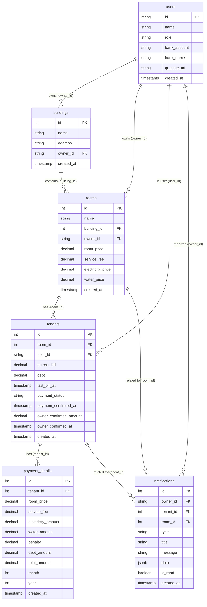

# Database Relationship Diagram

Bạn có thể xem biểu đồ này bằng cách sử dụng tính năng Preview Markdown của VS Code (Ctrl+Shift+V) nếu đã cài đặt extension hỗ trợ Mermaid (như "Markdown Preview Mermaid Support").

